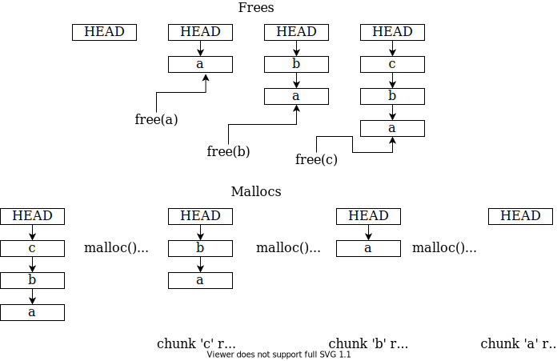

# Operations of the Fastbin

Fastbins are a singly-linked list of chunks. The point of these is that very small chunks are reused quickly and efficiently. To aid this, chunks of fastbin size **do not consolidate** (they are not absorbed into surrounding free chunks once freed).

A fastbin is a LIFO (Last-In-First-Out) structure, which means the last chunk to be added to the bin is the first chunk to come out of it. Glibc **only** keeps track of the HEAD, which points to the first chunk in the list (and is set to `0` if the fastbin is empty). Every chunk in the fastbin has an `fd` pointer, which points to the next chunk in the bin (or is `0` if it is the last chunk).

When a new chunk is freed, it's added at the **front** of the list (making it the head):

* The `fd` of the newly-freed chunk is overwritten to point at the old head of the list
* HEAD is updated to point to this new chunk, setting the new chunk as the head of the list

Let's have a visual demonstration (it will help)! Try out the following C program:

```c
#include <stdio.h>
#include <stdlib.h>

int main() {
    char *a = malloc(20);
    char *b = malloc(20);
    char *c = malloc(20);
    
    printf("a: %p\nb: %p\nc: %p\n", a, b, c);

    puts("Freeing...");

    free(a);
    free(b);
    free(c);

    puts("Allocating...");

    char *d = malloc(20);
    char *e = malloc(20);
    char *f = malloc(20);

    printf("d: %p\ne: %p\nf: %p\n", d, e, f);
}
```

We get:

```
a: 0x2292010
b: 0x2292030
c: 0x2292050
Freeing...
Allocating...
d: 0x2292050
e: 0x2292030
f: 0x2292010
```

As you can see, the chunk `a` gets reassigned to chunk `f`, `b` to `e` and `c` to `d`. So, if we `free()` a chunk, there's a good chance our next `malloc()` - if it's of the same size - will use the same chunk.

<figure><figcaption></figcaption></figure>

It can be really confusing as to why we add and remove chunks from the _start_ of the list (why not the end?), but it's really just the **most efficient way** to add an element. Let's say we have this fastbin setup:

```
HEAD --> a -> b
```

In this case HEAD points to `a`, and `a` points onwards to `b` as the next chunk in the bin (because the `fd` field of `a` points to `b`). Now let's say we free another chunk `c`. If we want to add it to the end of the list like so:

```
HEAD --> a -> b -> c
```

We would have to update the `fd` pointer of `b` to point at `c`. But remember that glibc **only keeps track of the first chunk in the list** - it only has the HEAD stored. It has no information about the end of this list, which could be many chunks long. This means that to add `c` in at the end, it would first have to start at the head and _traverse through the entire list_ until it got to the last chunk, **then** overwrite the `fd` field of the last chunk to point at `c` and make `c` the last chunk.

Meanwhile, if it adds at the HEAD:

```
HEAD --> c -> a -> b
```

All we need to do is:

* Set the `fd` of `c` to point at `a`
  * This is easy, as `a` was the old head, so glibc had a pointer to it stored already
* HEAD is then updated to `c`, making it the head of the list
  * This is also easy, as the pointer to `c` is freely available

This has **much** less overhead!

For reallocating the chunk, the same principle applies - it's much easier to update HEAD to point to `a` by reading the `fd` of `c` than it is to traverse the entire list until it gets to the end.
