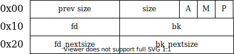

# Chunks

Internally, every chunk - whether allocated or free - is stored in a [`malloc_chunk` ](https://elixir.bootlin.com/glibc/glibc-2.39/source/malloc/malloc.c#L1136)structure. The difference is how the memory space is used.

## Allocated Chunks

When space is allocated from the **heap** using a function such as `malloc()`, a pointer to a heap address is returned. Every chunk has additional **metadata** that it has to store in both its used and free states.

.png>)

The chunk has two sections - the **metadata** of the chunk (information _about_ the chunk) and the **user data**, where the data is actually stored.

The `size` field is the overall size of the chunk, **including metadata**. It must be a multiple of `8`, meaning the last 3 bits of the `size` are `0`. This allows the flags `A`, `M` and `P` to take up that space, with `M` being the 3rd-last bit of `size`, `A` the 2nd-last and `P` the last.

The flags have special uses:

* `P` is the [`PREV_INUSE` flag](https://elixir.bootlin.com/glibc/glibc-2.39/source/malloc/malloc.c#L1210), which is set when the previous adjacent chunk (the chunk ahead) is in use
* `M` is the [`IS_MMAPPED` flag](https://elixir.bootlin.com/glibc/glibc-2.39/source/malloc/malloc.c#L1243), which is set when the chunk is allocated via `mmap()` rather than a heap mechanism such as `malloc()`
* `A` is the [`NON_MAIN_ARENA` flag](https://elixir.bootlin.com/glibc/glibc-2.39/source/malloc/malloc.c#L1221), which is set when the chunk is not located in `main_arena`; we will get to _Arenas_ in a later section, but in essence every created thread is provided a different arena (up to a limit) and chunks in these arenas have the `A` bit set

`prev_size` is set [if the previous adjacent chunk is **free**](https://elixir.bootlin.com/glibc/glibc-2.39/source/malloc/malloc.c#L1212), as calculated by `P` being `0`. If it is not, the heap _saves space_ and `prev_size` is part of the **previous chunk's user data**. If it is, then `prev_size` stores the size of the previous chunk.

.png>)

## Free Chunks

Free chunks have additional metadata to handle the linking between them.

<figure><figcaption></figcaption></figure>

This can be seen in the [`malloc_state`](https://elixir.bootlin.com/glibc/glibc-2.39/source/malloc/malloc.c#L1136) struct:

```c
struct malloc_chunk {
  INTERNAL_SIZE_T      mchunk_prev_size;  /* Size of previous chunk (if free).  */
  INTERNAL_SIZE_T      mchunk_size;       /* Size in bytes, including overhead. */

  struct malloc_chunk* fd;         /* double links -- used only if free. */
  struct malloc_chunk* bk;

  /* Only used for large blocks: pointer to next larger size.  */
  struct malloc_chunk* fd_nextsize; /* double links -- used only if free. */
  struct malloc_chunk* bk_nextsize;
};
```

