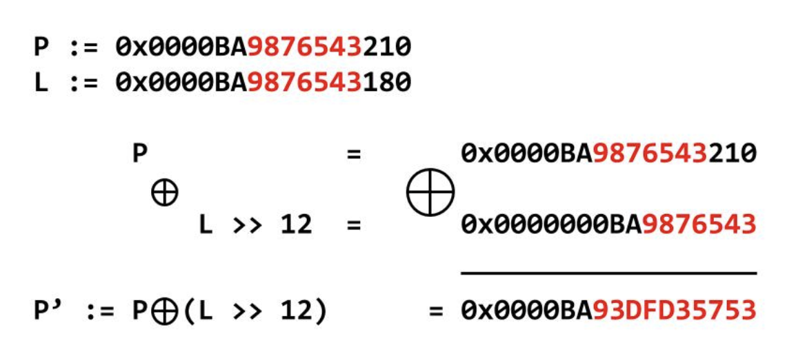

# The Numbers

We get a bit of an image:

<figure><figcaption></figcaption></figure>

The `{}` suggest that this is some sort of transposition, where letters are replaced with numbers while other characters are left the same. Since all the numbers are in the range `0-25`, it makes logical sense that each number is really the position of the letter in the alphabet. We can make a simple decryption script based off this assumption:

```python
from string import ascii_uppercase

numbers = [16, 9, 3, 15, 3, 20, 6, '{', 20, 8, 5, 14, 21, 13, 2, 5, 18, 19, 13, 1, 19, 15, 14, '}']

flag = ""

for n in numbers:
    if str(n) in "{}":
        flag += n
    else:
        flag += ascii_uppercase[n]

print(flag)

```

We get `QJDPDUG{UIFOVNCFSTNBTPO}`. As we assume it starts with `PICOCTF`, we can see that we are actually one index off - which makes sense, as strings are zero-indexed in Python, so we just need to use `n-1` and we get the flag:

```python
from string import ascii_uppercase

numbers = [16, 9, 3, 15, 3, 20, 6, '{', 20, 8, 5, 14, 21, 13, 2, 5, 18, 19, 13, 1, 19, 15, 14, '}']

flag = ""

for n in numbers:
    if str(n) in "{}":
        flag += n
    else:
        flag += ascii_uppercase[n-1]

print(flag)

# PICOCTF{THENUMBERSMASON}
```
